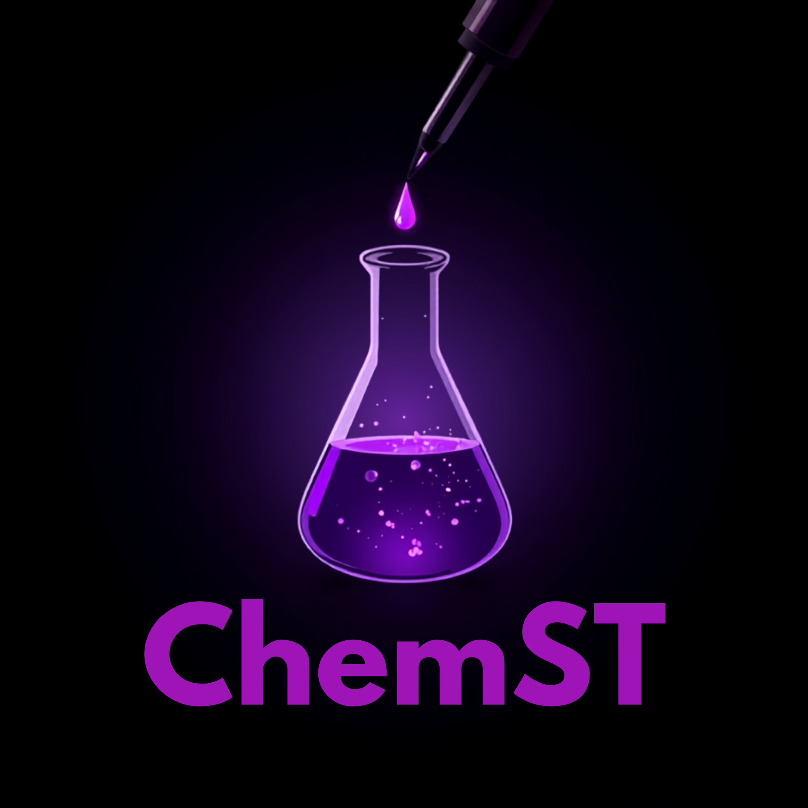
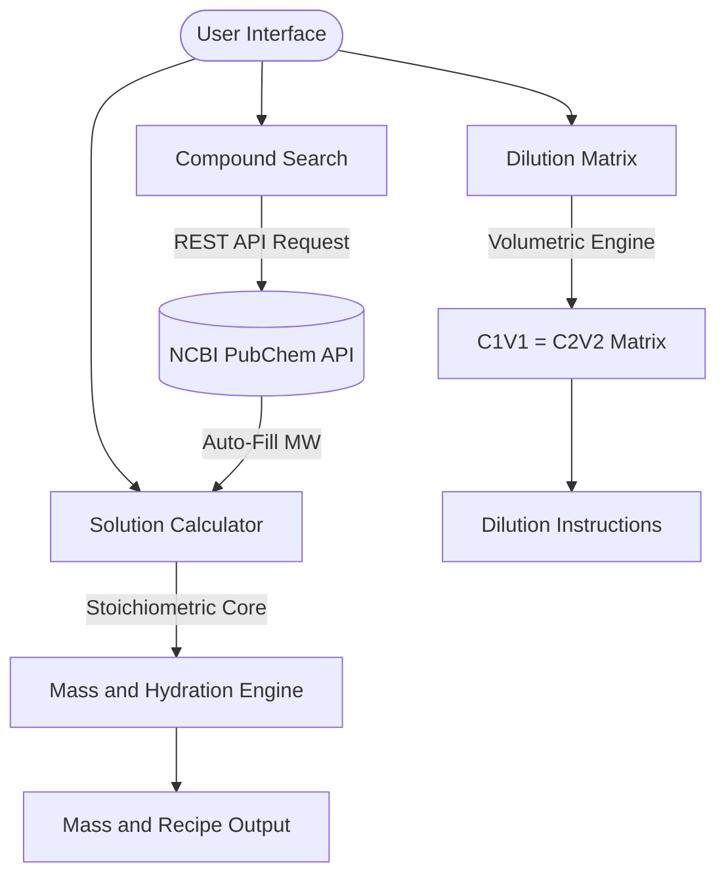

<p align="center">
  
</p>

<h1 align="center"> ChemST Web </h1>

<p align="center">
  <b>Interactive Chemical Solution & Stoichiometry Web Application</b>
</p>

<p align="center">
  <a href="https://efatihalbayin.github.io/chemst-web/">
    
  </a>
  <a href="https://pypi.org/project/chemst/">
    
  </a>
</p>

<p align="center">
  
  
  
</p>

---

**ChemST Web** is the official interactive frontend for the **ChemST** stoichiometry engine. Designed for computational chemists, laboratory researchers, and students, it provides an intuitive, high-precision dark/light-themed interface for preparing chemical solutions, executing stock dilutions, and querying compound data directly from the **NCBI PubChem API**.

---

##  Live Access

You can use the application directly in your web browser without any installation:

👉 **[Launch ChemST Web Application](https://efatihalbayin.github.io/chemst-web/)**

---

##  Key Features

- **Live PubChem REST API Query:** Search for chemical compounds by name to automatically fetch Molecular Weight (MW), IUPAC names, and PubChem CIDs.
- **Molar Solution Mass Calculator:** Calculate required solid mass for target molarities, with automatic adjustments for chemical purity (`% w/w`) and hydrate water molecules ($H_2O$).
- **Volumetric Dilution Matrix ($C_1V_1 = C_2V_2$):** Instant calculation of required stock solution volume ($V_1$) and necessary solvent addition for accurate lab dilutions.
- **Light & Dark Theme Toggle:** Single-click theme switching featuring a signature dark mode palette designed for low-light laboratory environments.
- **Fully Responsive UI:** Built with Flutter Web to deliver a smooth user experience across desktop computers, tablets, and smartphones.

---

##  Module Overview



##  Tech Stack & Architecture

* **Frontend:** [Flutter Web](https://flutter.dev/) (Dart)
* **API Integration:** [PubChem PUG REST API](https://pubchem.ncbi.nlm.nih.gov/docs/pug-rest) via `http` package
* **Deployment:** GitHub Pages continuous deployment

---

##  Local Development & Build

To run or build the web application locally:

1. **Clone the repository:**
```bash
git clone [https://github.com/efatihalbayin/chemst-web.git](https://github.com/efatihalbayin/chemst-web.git)

```


2. **Get dependencies:**
```bash
flutter pub get

```


3. **Run locally:**
```bash
flutter run -d chrome

```


4. **Build for Web release:**
```bash
flutter build web --release --base-href "/chemst-web/"

```


---

## License

Distributed under the MIT License. See [LICENSE](LICENSE) for details.

---

##  Author

Developed by **Ertan Fatih Albayın** from Istanbul Technical University (ITU)

* **LinkedIn:** [Ertan Fatih Albayın](https://www.linkedin.com/in/ertan-fatih-albay%25C4%25B1n-90a606279/)
* **GitHub:** [@efatihalbayin](https://github.com/efatihalbayin)
* **Python Library:** [chemst on PyPI](https://pypi.org/project/chemst/)
