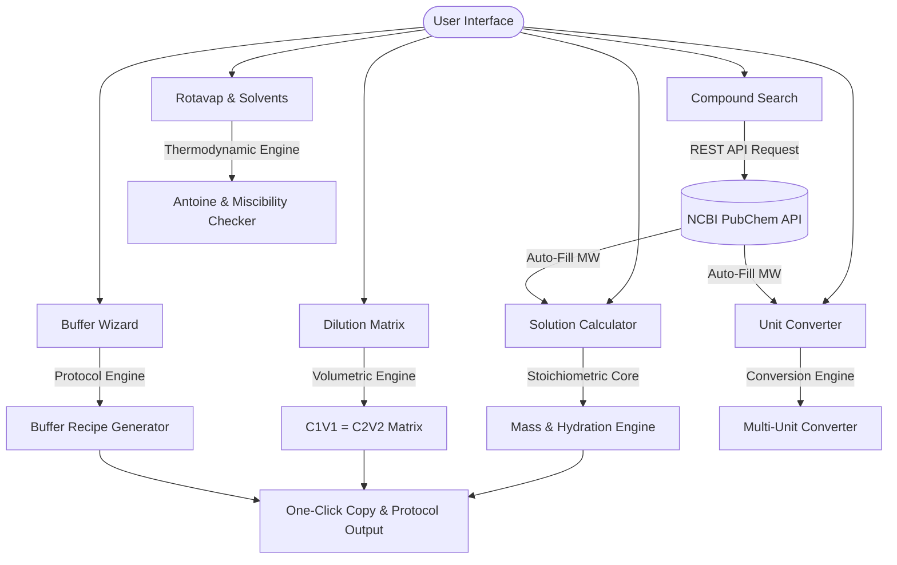

<p align="center">
  
</p>

<h1 align="center"> ChemST Web </h1>

<p align="center">
  <b>Your Lab Partner</b>
</p>

<p align="center">
  <a href="https://efatihalbayin.github.io/chemst-web/">
    
  </a>
  <a href="https://pypi.org/project/chemst/">
    
  </a>
</p>

<p align="center">
  
  
  
</p>

---

**ChemST Web** is the official interactive frontend for the **ChemST** stoichiometry and laboratory engine. Designed for computational chemists, laboratory researchers, academicians, and students, it provides an intuitive, high-precision dark/light-themed interface for preparing chemical solutions, executing stock dilutions, generating buffer protocols, and performing advanced physical/chemical conversions.

---

##  Live Access

You can use the application directly in your web browser without any installation:

👉 **[Launch ChemST Web Application](https://efatihalbayin.github.io/chemst-web/)**

---

##  Key Features

- ** Live PubChem REST API Query:** Search compounds by name to fetch Molecular Weight (MW), IUPAC names, CAS numbers, 2D structural formulas, and copyable SMILES strings.
- ** Molar Solution Mass Calculator:** Calculate required solid mass for target molarities with automatic adjustments for purity (`% w/w`) and hydrate water molecules ($H_2O$).
- ** Volumetric Dilution Matrix ($C_1V_1 = C_2V_2$):** Instant calculation of required stock solution volume ($V_1$) and necessary solvent addition.
- ** Buffer & Recipe Wizard:** Automated protocol generator for standard laboratory buffers (*Tris-HCl, PBS 1X, HEPES, TE, TAE, Citrate, MOPS, etc.*) with step-by-step preparation guidelines.
- ** Comprehensive Chemical Unit Converter:** Convert Molar subunits ($\text{M}$ to $\text{pM}$), Analytical units ($\text{ppm, ppb, mg/L}$), Stock Acid/Base concentration & Normality ($\text{N}$), Physical units ($\text{mbar, mmHg, °C, K}$), and Spectroscopy energy ($\text{nm, cm}^{-1}, \text{eV, kJ/mol}$).
- ** Rotavap & Solvent Miscibility Helper:** Check phase separation behavior (biphasic vs. miscible) across 13+ solvents and calculate vacuum boiling points using Antoine equations.
- ** One-Click Recipe Copying:** Instant Clipboard integration to easily copy preparation instructions for lab notebooks or messaging.
- ** Responsive UI & Theme Switcher:** Smooth cross-device layout featuring a signature dark mode designed for low-light laboratory environments.

---

##  Module Overview



---

##  Tech Stack & Architecture

* **Frontend:** [Flutter Web](https://flutter.dev/) (Dart)
* **API Integration:** [PubChem PUG REST API](https://pubchem.ncbi.nlm.nih.gov/docs/pug-rest) via `http` package
* **Equations & Thermodynamics:** Custom Antoine Equation solver & Clausius-Clapeyron vacuum estimators
* **Deployment:** GitHub Pages continuous deployment

---

##  Local Development & Build

To run or build the web application locally:

1. **Clone the repository:**

```bash
git clone [https://github.com/efatihalbayin/chemst-web.git](https://github.com/efatihalbayin/chemst-web.git)
cd chemst-web

```

2. **Get dependencies:**

```bash
flutter pub get

```

3. **Run locally:**

```bash
flutter run -d chrome

```

4. **Build for Web release:**

```bash
flutter build web --release --base-href "/chemst-web/"

```

---

##  License

Distributed under the MIT License. See `LICENSE` for details.

---

##  Author & Developer

Developed by **Ertan Fatih Albayın**

* **LinkedIn:** [Ertan Fatih Albayın](https://www.linkedin.com/in/ertan-fatih-albay%2525C4%2525B1n-90a606279/)
* **GitHub:** [@efatihalbayin](https://github.com/efatihalbayin)
* **Python Library:** [chemst on PyPI](https://pypi.org/project/chemst/)
